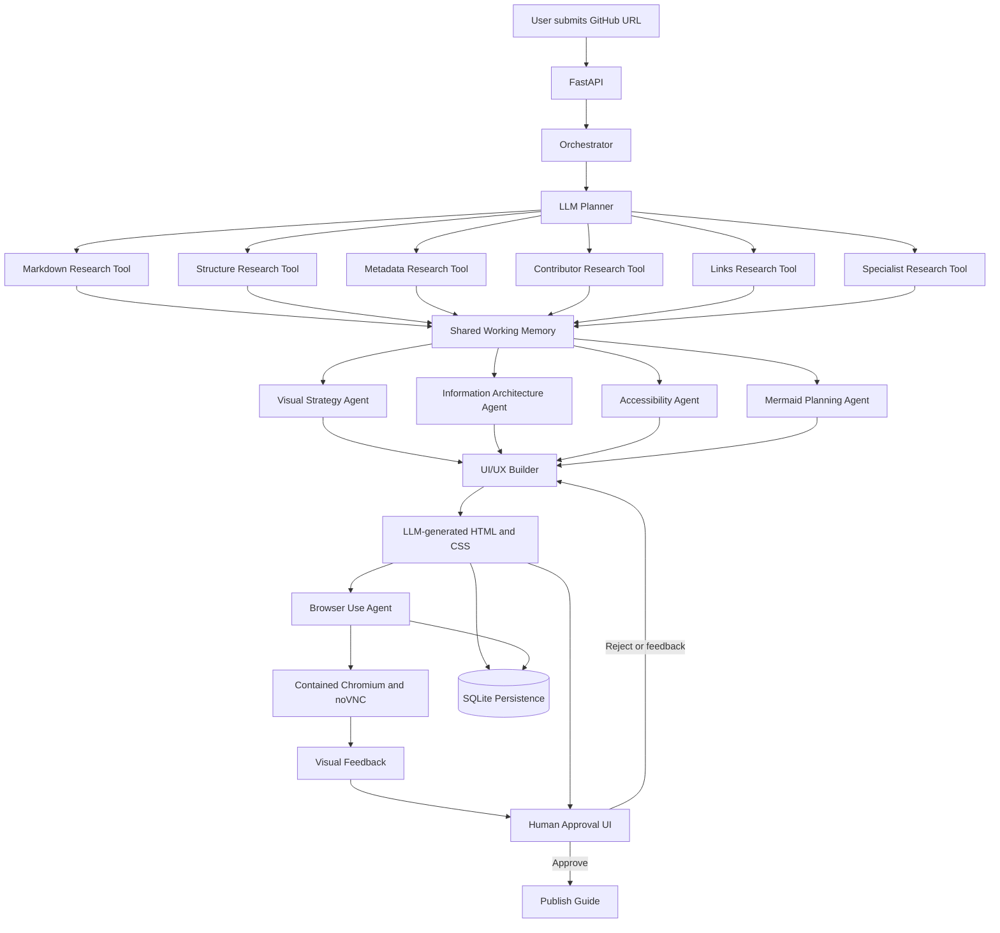

# Reapit

Reapit turns a public GitHub repository into a polished, evidence-based HTML guide. It uses Backboard (`gpt-5.6-luna`), LangGraph, LangSmith tracing, parallel research tools, UI planning agents, and a final HTML QA agent.

## Run locally

```bash
cd /home/lenovo/repo-reader
python3 -m venv .venv
source .venv/bin/activate
pip install -e .
cp .env.example .env
python -m app.main https://github.com/owner/repository
```

Output:

```text
outputs/<repository>/index.html
```

## Docker and FastAPI

The service runs on port `8088` because ports `8000` and `8001` may already be occupied locally.

```bash
docker compose up -d --build
curl http://localhost:8088/health
```

Generate a guide:

```bash
curl -X POST http://localhost:8088/generate \
  -H 'Content-Type: application/json' \
  -d '{"url":"https://github.com/owner/repository"}'
```

Open a generated guide:

```text
http://localhost:8088/open/<repository>
```

Static guide access is also available at:

```text
http://localhost:8088/guides/<repository>/index.html
```

FastAPI documentation:

```text
http://localhost:8088/docs
```

Run persistence and human review endpoints:

```bash
curl http://localhost:8088/runs
curl http://localhost:8088/runs/<run_id>
curl -X POST 'http://localhost:8088/runs/<run_id>/decision?approved=true'
```

Runs are persisted in `outputs/reapit.db`. Every generation receives a run ID, records running/completed/failed status, stores bounded state and QA results, and remains pending human approval until a reviewer approves or rejects it. Backboard network calls retry up to three times with exponential backoff.

## Agent workflow

```text
GitHub URL
   ↓
Orchestrator + bounded working memory
   ↓
LLM planner
   ↓
Parallel research tools
   ├── Markdown selection and analysis
   ├── File-structure analysis
   ├── Metadata analysis
   ├── Contributor analysis
   ├── Related-link analysis
   └── Specialist-artifact analysis
   ↓
Parallel UI planning agents
   ├── Visual strategy
   ├── Information architecture
   ├── Accessibility and readability
   └── Mermaid diagram strategy
   ↓
LLM UI/UX builder
   ├── layout_html
   ├── custom_css
   ├── theme
   ├── content
   └── Mermaid diagrams
   ↓
LLM HTML QA and repair agent
   ↓
Persistence + human approval
   ↓
Safe HTML renderer
```

All agent roles are Backboard-backed. Tools only collect bounded repository evidence; interpretation and design decisions are made by LLM agents. The final QA agent can repair layout, CSS, and Mermaid output before rendering.

## Working memory

Working memory is temporary and scoped to one run. It contains:

- Run ID and memory version
- Repository metadata
- Planner-selected roles
- Parallel findings
- UI planning results
- Proposed guide
- QA results

Memory is serialized deterministically, bounded before every LLM call, and marked when truncated. Prompts require provenance, conflict reporting, and explicit unknowns.

## LLM and tracing configuration

Copy `.env.example` to `.env` and configure:

```env
BACKBOARD_API_KEY=...
BACKBOARD_BASE_URL=https://app.backboard.io/api
BACKBOARD_MODEL=gpt-5.6-luna
LANGCHAIN_TRACING_V2=true
LANGCHAIN_API_KEY=...
LANGCHAIN_PROJECT=reapit
```

Backboard is called through its native assistant → thread → message API. Each call is wrapped with LangSmith tracing. If Backboard is unavailable, a deterministic fallback prevents the API from crashing, but high-quality agent-generated layout requires a valid Backboard configuration.

Per-agent output limits are configurable with variables such as:

```env
REAPIT_UIUX_MAX_TOKENS=50000
REAPIT_MARKDOWN_MAX_TOKENS=2400
REAPIT_SPECIALIST_MAX_TOKENS=2400
```

## UI/UX skills

Five web-design references are versioned in `skills/` and supplied to the UI/UX builder:

- Anthropic frontend design
- Anthropic web-artifacts builder
- Anthropic canvas design
- Vercel web-design guidelines
- Vercel composition patterns

The UI/UX agent owns the frontend layout and CSS. The renderer does not impose a fixed visual shell; it only performs safe placeholder replacement, Mermaid execution, and basic sanitization.

## System architecture



## Tests and deployment

Run syntax checks and tests locally:

```bash
python3 -m compileall -q app
python3 -m pytest -q
```

Rebuild the running service after code or prompt changes:

```bash
docker compose up -d --build
```
